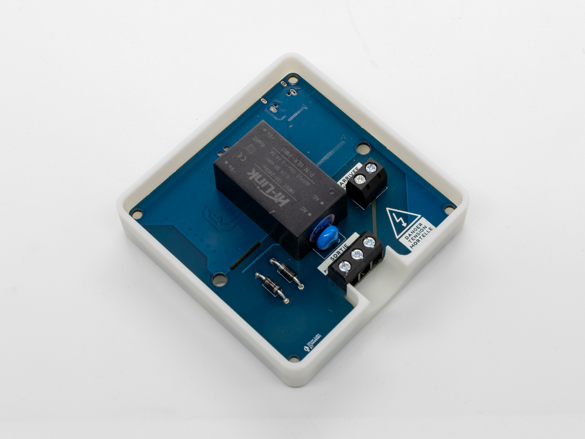

# MySensors nRF24 Electric Heater Pilot
Opensource DIY thermostat for electric heaters in France

### Get one

### What is MySensors?
Always wanted to make your own IoT sensors to automate your home? [MySensors](https://www.mysensors.org/) does all the heavy lifting so you can focus on what matters. It integrates into a lot of [controllers](https://www.mysensors.org/controller) (Home Assistant, Jeedom, Domoticz, and more) so you can easily connect custom made devices into your existing home automation setup.

### Description
This module allows the integration of French electric heaters with any home automation controller supported by MySensors through the use of the [fil pilote](https://fr.wikipedia.org/wiki/Chauffage_%C3%A9lectrique#Fil_pilote) functionality.

It is designed to fit on top of the 67mm flush-mounted electrical box that supplies the heater. There is one input connector (live and neutral) from the wall, and one output connector (live, neutral and pilot) to the heater.

### Features
- Designed for [MySensors](https://www.mysensors.org/) with a nRF24 radio
- Uses the [fil pilote](https://fr.wikipedia.org/wiki/Chauffage_%C3%A9lectrique#Fil_pilote) system present on fixed heaters in France
- Designed to fit on top of 67mm flush-mounted electrical boxes
- Self powered from the 230VAC input
- Screw terminals for easier connection, no soldering required
- Integrated temperature and humidity sensor
- Opensource firmware

### Known limitations
Because the temperature sensor will be close to the radiator, the temperature readings might not be accurate. For this reason, it is recommended to use an additional temperature sensor located in the room and configure your home automation software to use it instead. For Home Assistant, I recommend the great plugin [Better Thermostat](https://github.com/KartoffelToby/better_thermostat).
